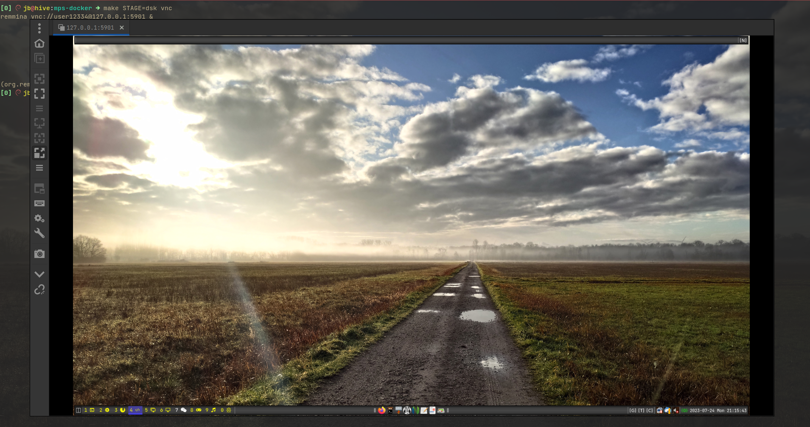

# mps-docker
A dockerized version of the mps script collection
([Link](https://github.com/odem/mps)).
Builds containers for testing purposes into the three stages (boot,term,dsk).
Boot creates a user and password, term installs terminal essentials
and dsk a customized tiling window manager(qtile).


Help messages are available via the help target:
```
Usage: make [PARAM=VALUE] [TARGET]

  TARGETS
       all    : rebuild start and exec
       rebuild: clean and build
       clean  : Removes generated image
       build  : Builds the entire image from scratch
       start  : Starts a container from the generateed image
       stop   : Stop a running container
       exec   : Executes command within running container
       vnc    : Connects a running container via vnc (desktop only)
       push   : push STAGE image to dockerhub
       help   : This help message
  PARAMS
       STAGE          : The scripts to execute (boot,term,dsk)
       PORT           : The port to connect via vnc
       OPT_RUN_DOCKER : Optionas passed to docker on start
```

Individual steps to build:
```
make STAGE=boot clean
make STAGE=boot build
make STAGE=boot PORT=6000 OPT_RUN_DOCKER=-d start
make STAGE=boot PORT=6000 exec
make STAGE=boot PORT=6000 stop
```
Or all in one and with default parameters:
```
make STAGE=term all
make STAGE=term exec
make STAGE=term stop
```
Connection via vnc (Password is 'user1234'):
```
make STAGE=dsk all
make STAGE=dsk vnc
make STAGE=dsk stop
```
 \
Voila! A dockerized mps system.

The images are also available on docker hub.
Respective image names are:
- livemps/mps-boot [mps-boot](https://hub.docker.com/r/livemps/mps-boot)
- livemps/mps-term [mps-term](https://hub.docker.com/r/livemps/mps-term)
- livemps/mps-dsk [mps-dsk](https://hub.docker.com/r/livemps/mps-dsk)

